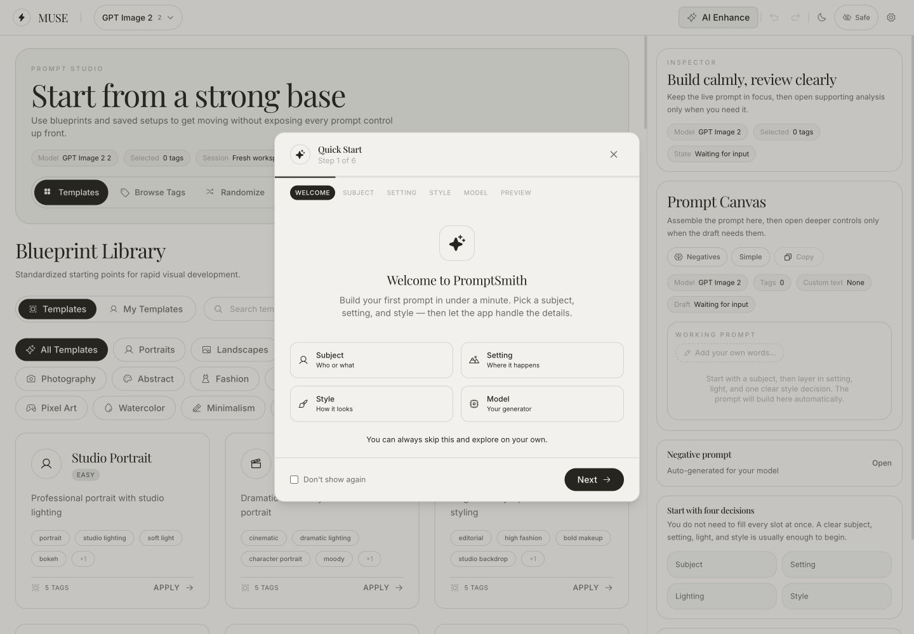
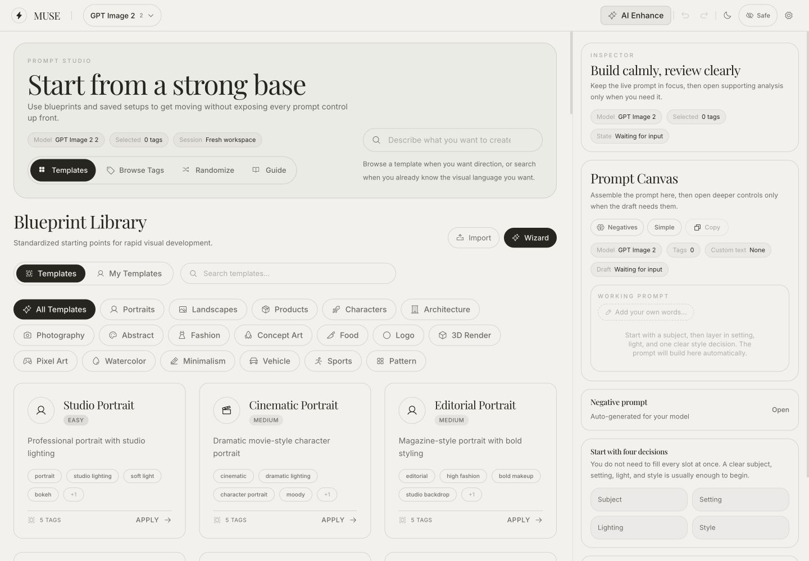
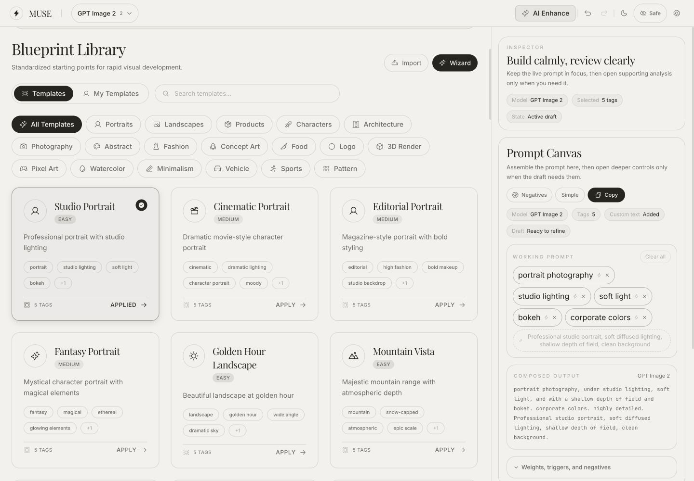
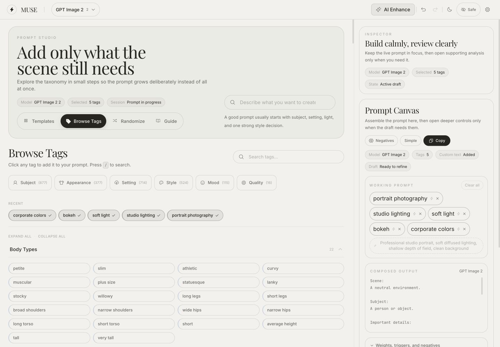
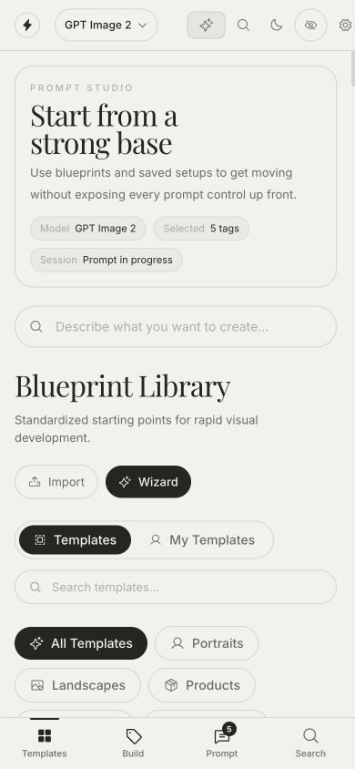
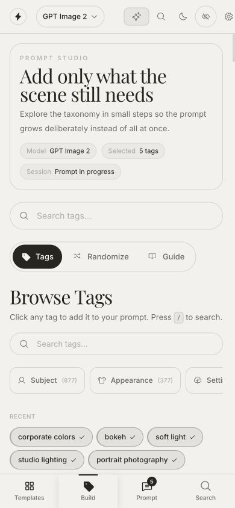
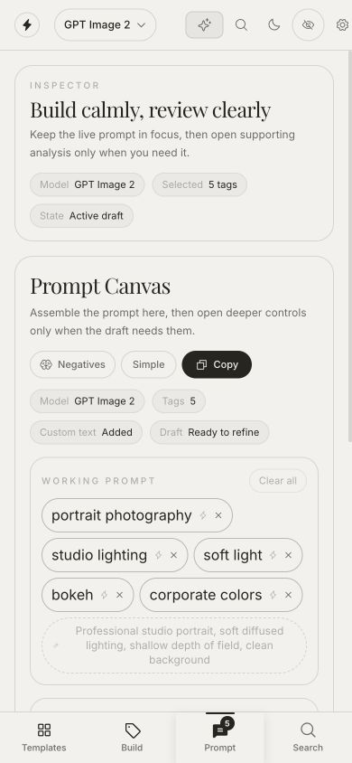

# MUSE Product UX/UI Audit

Date: 2026-07-12  
Scope: first run, template discovery, advanced tag building, prompt output, and mobile PWA navigation  
Product intent: a private, local-first daily workspace for crafting image prompts, useful to beginners and advanced creators

## Overall verdict

MUSE has a strong product foundation: model-aware prompt composition, a deep taxonomy, templates, local persistence, and optional local AI. The interface is thoughtful and visually coherent, but it currently behaves more like a well-designed prompt database than the fastest place to turn an idea into a strong prompt.

The main design problem is not missing capability. It is priority. Explanations, status chips, filters, categories, and secondary tools frequently appear before the user's next useful action or result. The redesign should make one loop unmistakable:

**Describe → improve → inspect → copy/save → reuse.**

Templates, taxonomy, randomization, negatives, weights, references, and local AI should progressively support that loop instead of competing with it.

## Flow audit

### 1. First run — Needs improvement

**Strengths**

- The wizard promises a concrete outcome: a first prompt in under a minute.
- The four concepts (subject, setting, style, model) provide a clear mental model.
- Skip and “Don’t show again” preserve user control.

**Risks**

- The product is branded MUSE in the shell and PromptSmith in the wizard. This makes the first interaction feel unfinished and weakens trust.
- Six steps are heavy for a tool whose value should be visible almost immediately.
- The wizard appears over an already information-dense workspace, so a new user sees two competing onboarding systems at once.
- The wizard explains the product before letting the user try the core input.

**Recommendation**

Replace the six-step modal with an inline first-use composer: one large “What do you want to create?” field, 3–4 example chips, a model default, and a single “Craft prompt” action. After the first result, teach setting/style refinements contextually.

### 2. Empty desktop workspace — Mixed

**Strengths**

- The warm, editorial visual language is distinctive and calmer than typical AI tools.
- Templates, tag browsing, randomization, and guide establish a sensible beginner-to-expert spectrum.
- The right-side prompt canvas keeps output available while browsing.

**Risks**

- “Start from a strong base,” the supporting paragraph, three status pills, mode switcher, search helper, “Blueprint Library,” and another paragraph all compete before the first template.
- The empty inspector repeats model, selected count, and state information already shown elsewhere.
- The primary search field is visually modest and placed beside metadata; it should be the dominant product entry point.
- The library exposes many category filters at once, creating a storefront/catalog feeling rather than a fast creative tool.
- The right inspector consumes roughly one third of the viewport before it contains a useful output.

**Recommendation**

Make the omnibox the visual hero. In an empty state, collapse the inspector into a narrow preview rail or hide it until a draft exists. Show “Recent,” “Favorites,” and 4–6 personalized starters before the full template catalog.

### 3. Template applied — Good foundation, weak result priority

**Strengths**

- Applying a template is fast and immediately populates the working prompt.
- Tags remain editable and the composed output is model-specific.
- Copy is clear and undo becomes available.

**Risks**

- The selected template remains the largest object while the actual output is confined to a narrow column.
- The composed prompt is visually low contrast and uses small mono text, which reduces scanability.
- “Inspector,” “Build calmly, review clearly,” “Prompt Canvas,” its description, and several metadata chips add ceremony after the user already has a result.
- A template adds “corporate colors” and custom text that may surprise the user; the interface does not explain why each ingredient was added.
- Saving is not a primary action beside Copy, despite daily reuse being central to the product.

**Recommendation**

After any starter is applied, shift the layout into result mode: enlarge the prompt, show a concise change summary, and present **Copy**, **Save**, and **Try a variation** together. Keep the source template in a compact breadcrumb (“Based on Studio Portrait”).

### 4. Advanced tag browser — Powerful but overwhelming

**Strengths**

- Search, semantic groups, recent tags, counts, and inline selection create genuine expert power.
- The live prompt remains visible as tags are added.
- Recent selections support fast repeated work.

**Risks**

- Categories such as Subject (877) and Setting (714) communicate scale, not usefulness. Large counts can increase anxiety.
- The first expanded section is Body Types, which is not a universal next step and may feel oddly specific.
- A user can see two tag-search fields in the same view.
- “Expand all” is dangerous at this information volume and invites an unusable state.
- Taxonomy language is dataset-oriented (“Camera 1,” “Expanded,” “Ai Generated”) rather than task-oriented.

**Recommendation**

Default to “What is missing?” recommendations based on the current prompt: Subject, Setting, Lighting, Composition, Style. Let search be the main expert entry point. Put the complete taxonomy behind “Browse all,” remember the user’s preferred sections, and rank categories by relevance rather than source-file order.

### 5. Mobile templates — Needs major simplification

**Strengths**

- Bottom navigation maps well to the core tasks: Templates, Build, Prompt, Search.
- The PWA layout is stable and respects a persistent output destination.
- Touch navigation is easy to understand.

**Risks**

- At 390×844, the first template card is below the fold. The user sees branding, explanation, status pills, search, a second heading, another explanation, import/wizard, tabs, another search, and filters before content.
- Search exists in the header, main content, template library, and bottom navigation.
- Import and Wizard are given premium space despite being occasional actions.
- The mobile header has several icon-only controls with unclear purpose for new users.

**Recommendation**

The mobile start screen should show: one composer, recent prompts, and a horizontally scrollable row of starter templates. Move Import, Wizard, model configuration, safety mode, theme, and local connections into a compact menu or settings sheet.

### 6. Mobile build — Mixed

**Strengths**

- The Templates / Build / Prompt split is clearer on mobile than the desktop’s simultaneous two-panel layout.
- Recent selected tags provide continuity.
- Tags, Randomize, and Guide form a useful progressive tool set.

**Risks**

- The page repeats the large hero and search before the actual tag browser, then repeats search again.
- The horizontal semantic group row is clipped, with no strong affordance that more categories exist.
- Category counts dominate small-screen labels without helping the task.
- The visible content still starts with navigation and metadata rather than relevant refinements.

**Recommendation**

Use one sticky search/composer per screen. Directly beneath it, show 3–6 context-aware suggestions and a “Browse all tags” affordance. Keep Randomize and Guide as actions inside the composer rather than another segmented navigation layer.

### 7. Mobile prompt — Good structure, too much preamble

**Strengths**

- The prompt is separated into editable ingredients and composed output.
- Copy is prominent and reachable.
- Advanced tools remain available below the main draft.

**Risks**

- Two large explanatory cards consume most of the first viewport before the composed output.
- The screen repeats model, tag count, custom-text state, and draft state.
- The most valuable artifact—the final prompt—is below the fold.
- Small 10×10 icon buttons inside tag chips are below recommended touch-target sizes and have no accessible names in the rendered DOM.

**Recommendation**

Put the composed output first, with a sticky Copy button. Make ingredients a collapsible “5 ingredients” section. Replace metadata pills with one quiet line such as “GPT Image 2 · saved locally.”

## Highest-impact changes

### P0 — Rebuild the core hierarchy

1. Make a single universal composer the home screen and global command surface.
2. Put the generated/crafted prompt at the center of the product after the first action.
3. Remove repeated descriptions and duplicate status chips.
4. Show advanced controls only when the prompt or user asks for them.
5. Unify the MUSE/PromptSmith naming immediately.

### P1 — Build an everyday loop

1. Add Recent, Favorites, and Pinned prompts as first-class home content.
2. Put Copy, Save, Duplicate, and Variation beside the output.
3. Remember preferred model, output format, last-used taxonomy groups, and recent searches locally.
4. Add prompt history with human-readable versions (“Added golden-hour light”) rather than only Undo/Redo.
5. Make local/offline state reassuring but quiet: “Saved on this device” and “Works offline.”

### P1 — Serve beginners and experts without two separate products

- **Simple mode:** idea input, model auto-selection or one default, a few guided refinements, final prompt.
- **Studio mode:** taxonomy, weights, triggers, negatives, references, model syntax, compression, and local AI.
- Use the same prompt object and history in both modes, so users can move between them without losing work.

### P2 — Improve discovery

1. Merge template search, tag search, and command search into one omnibox with grouped results.
2. Rank refinements based on gaps in the current prompt instead of taxonomy order.
3. Replace giant category counts with plain-language cues such as “Lighting” or “Camera & framing.”
4. Learn locally from frequent selections and surface personal shortcuts.

### P2 — Accessibility and input quality

1. Increase all interactive targets to at least 44×44 CSS pixels on touch screens.
2. Give every icon-only control an accessible name and visible tooltip where appropriate.
3. Add a real modal focus trap, focus return, and `aria-modal` behavior to the wizard/settings dialogs.
4. Verify the faint text tokens and small mono output against WCAG contrast requirements.
5. Ensure selected tag state is not communicated only through subtle border/color changes.
6. Test keyboard flow, 200% zoom, screen-reader announcements for prompt changes, and reduced-motion behavior.

## Proposed product structure

### Home

- Universal “Describe an image or paste a prompt” composer
- Recent prompts
- Favorites / pinned building blocks
- A small starter row (Portrait, Product, Scene, Typography, Surprise me)
- Quiet device status: local, offline-ready, last saved

### Craft workspace

- Main: composed prompt and conversational/simple editing
- Supporting drawer: ingredients, suggestions, templates, taxonomy
- Output actions: Copy, Save, Duplicate, Variation
- Advanced drawer: model syntax, weights, negatives, references, compression, local AI

### Library

- Saved prompts, templates, entities, references, and history in one private local library
- Search, filter, pin, export, import, and local backup

### Settings

- Models and formatting defaults
- Local AI connections
- Privacy/offline/storage explanation
- Safety and explicit-content preferences
- Appearance and PWA management

## What “Google for image prompt crafting” should mean

It should not mean showing the entire index. It should mean accepting almost any starting point and finding the shortest useful path:

- vague idea → structured prompt
- existing prompt → critique and improvement
- image/reference → reusable visual ingredients
- expert terms → exact model syntax
- repeated task → saved shortcut

The interface should feel like search first, a writing tool second, and a database only when the user deliberately opens the database.

## Evidence limits

- This is a combined UX, UI, and screenshot-based accessibility audit of the local app at desktop and 390×844 mobile viewport sizes.
- It does not establish WCAG compliance. Screen-reader behavior, full keyboard traversal, focus trapping, browser/PWA installation prompts, offline cache behavior, and 200% zoom require dedicated testing.
- Local AI connection setup, import/export, randomizer depth, reference-image upload, and every model configuration were outside the captured core flow.
